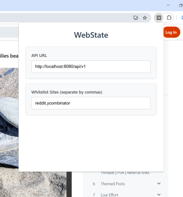
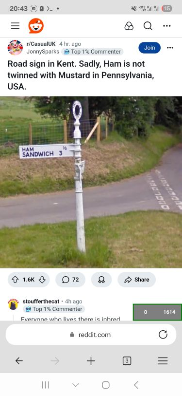
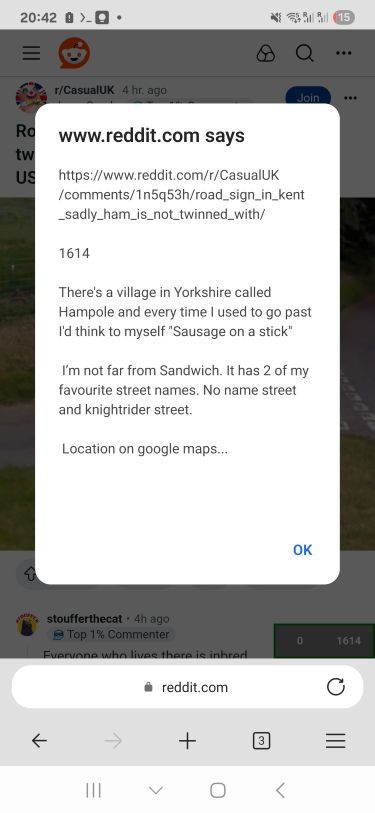
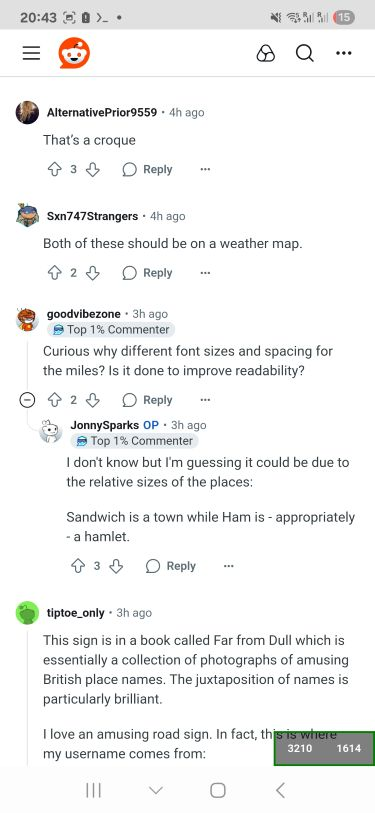
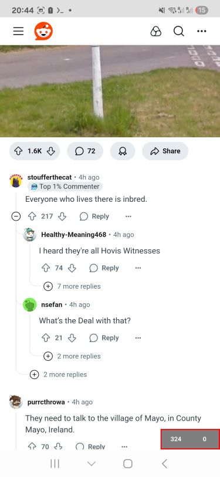

# WebState

## Overview
A browser extension and backend service that preserves scroll position and visible content across page reloads in Single Page Applications (SPAs). Built to enhance research workflows by maintaining state even when browsers unexpectedly refresh tabs.

## Features
The solution consists of a Go API with PostgreSQL persistence running on Termux, paired with an event-driven browser extension compatible with both desktop and mobile browsers. A minimalist UI indicator shows current and saved scroll positions, with visual API health status (border). The system automatically saves scroll position and visible text content, restoring state seamlessly after page reloads.

## Screenshots

### Extension Popup


### Saved Scroll Position


### Saved Text Content


### Scroll State Indicator


### API Connection Status


## Stack

- Go
- PostgreSQL
- testcontainers
- Docker
- Termux Android, Edge Mobile
- Chrome Extension
  - TypeScript
  - esbuild
  - Vitest

## Development

### Backend

```bash
docker-compose up -d
```

### Client (Browser Extension)

- `cd browser-extension`
- `npm install` (when first cloned)
- `npm run watch`

Load the unpacked extension (dist folder) in Chrome (chrome://extensions).
Fill in the API URL in the extension (popup) window. It should be http://localhost:8080/api/v1 when running locally.
Whitelist the sites.

Use the AutoHotkey window switcher script (window-switcher.ahk).

Set the reload keybind from manifest.json in the Keyboard Shortcuts settings on the Chrome Extensions page.

Mouse 1 + W switches to Chrome and reloads the extension.

## Testing

```go
go test -v./...

go test -coverprofile= coverage.out./...

go tool cover --html = coverage
```
